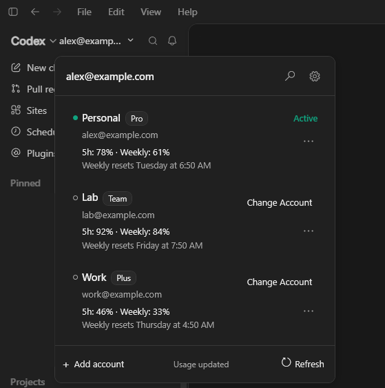
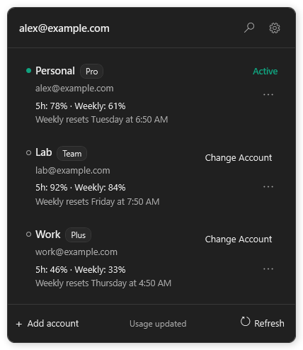

# Roster Companion

**A lightweight account and usage manager for the ChatGPT desktop app**

Roster Companion adds an account selector in the title bar, just left of the window controls, in the official Windows ChatGPT app. It runs as a separate process, does not inject into or modify ChatGPT, and disappears whenever ChatGPT is minimized, closed, or covered by another application.

> [!WARNING]
> Roster Companion is pre-release, unofficial software. Account switching and usage retrieval depend partly on local compatibility surfaces that may change when ChatGPT is updated. Finish active Codex tasks before changing accounts.

> [!IMPORTANT]
> Releases are currently unsigned, so Microsoft Defender SmartScreen may show **Windows protected your PC** on first launch. Download only from this project's GitHub Releases page and verify the ZIP against `SHA256SUMS.txt`. See [Troubleshooting](docs/TROUBLESHOOTING.md) before bypassing any warning.

## See it in action

Roster Companion places an account selector in the desktop app's title bar, so switching accounts and checking usage does not require another window. The screenshots below show the previous placement beside the Codex/ChatGPT selector.



The dropdown shows the active account, aliases, plan, five-hour usage, weekly usage, reset timing, search, refresh, and account actions in one compact view.



## Features

- Automatically detects the account currently used by ChatGPT with a one-time confirmation.
- Shows aliases, email addresses, plans, five-hour usage, weekly usage, and reset times.
- Searches accounts from the compact dropdown.
- Safely changes accounts with task detection, credential and session backup, validation, rollback, and automatic ChatGPT reopening.
- Adds accounts through an isolated official Codex CLI login when available.
- Uses a guarded ChatGPT sign-in flow with recovery when the CLI is unavailable.
- Refreshes active and inactive usage on separate schedules and marks failed data as stale.
- Matches ChatGPT's light or dark appearance and follows its window across monitors and DPI changes.
- Starts with Windows by default and can be disabled in Task Manager or from the attached gear menu.

## Requirements

- Windows 10 or 11, x64.
- The current official ChatGPT desktop app installed from the `OpenAI.Codex` Windows package.
- Internet access for sign-in and usage refresh.

## Install a release

**[Download RosterCompanion.exe for Windows x64](https://github.com/tanagornf/roster-companion/releases/download/v0.1.2/RosterCompanion.exe)** — save it in a permanent folder and double-click it. No installer or separate .NET installation is required.

The [v0.1.2 release page](https://github.com/tanagornf/roster-companion/releases/tag/v0.1.2) also has a ZIP with documentation and license notices, plus `SHA256SUMS.txt` for verifying either download.

1. Save `RosterCompanion.exe` in a permanent folder and run it. If using the ZIP, extract it first.
2. Bring ChatGPT to the foreground. Confirm the detected current account once.

### Updating an older copy

Exit the running Roster Companion using **gear menu → Exit Roster Companion**. Replace its old `RosterCompanion.exe` with the new download in the same folder, then run the new EXE. If you saved the new EXE in a different folder, you can delete the old EXE after exiting it. Do not delete `%APPDATA%\ChatGPTRoster`: that folder contains your accounts and settings, and the new version reads it automatically. Running the new EXE updates the **Start with Windows** path if that setting is enabled. Roster Companion does not update itself automatically; launching a second copy while the old one runs shows an update reminder.

Roster Companion waits silently when ChatGPT is not open. Use the gear icon in the attached dropdown for **Start with Windows**, **About**, and **Exit Roster Companion**.

## Local storage and privacy

Everything Roster Companion stores, including profiles, credentials, cached usage data, and backups, remains on your device under `%APPDATA%\ChatGPTRoster`. The existing directory name is retained so upgrades preserve previously enrolled profiles.

Roster Companion has no telemetry, ads, analytics, or developer-operated servers. It connects exclusively to official OpenAI services when needed for sign-in and usage refresh. See [PRIVACY.md](PRIVACY.md) and [SECURITY.md](SECURITY.md).

## Build from source

```powershell
dotnet restore .\ChatGPTRoster.sln
dotnet build .\ChatGPTRoster.sln --configuration Release --no-restore
dotnet test .\ChatGPTRoster.sln --configuration Release --no-build
```

Run locally:

```powershell
dotnet run --project .\src\ChatGPTRoster\ChatGPTRoster.csproj
```

Create a self-contained package:

```powershell
.\scripts\Build-Release.ps1 -Version 0.1.2
```

## Security boundaries

- Roster Companion only closes processes whose executable paths match the installed OpenAI ChatGPT package.
- It never implements an unofficial OAuth client, captures browser cookies, or asks users to paste credentials.
- Account changes retain recoverable credential and bounded desktop-session backups.
- Removing a local profile does not delete the OpenAI account.
- The active account cannot be removed. Change to another account first.

## Disclaimer

Roster Companion is an unofficial community project built by tanagornf. It is not affiliated with or endorsed by OpenAI.

## License

MIT © 2026 tanagornf.
